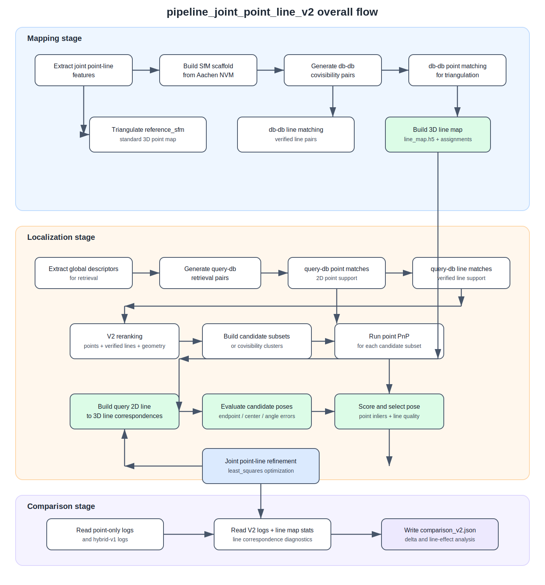
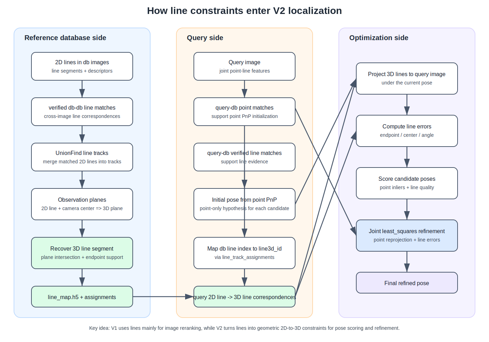
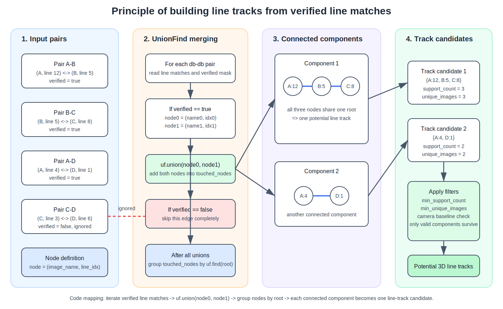
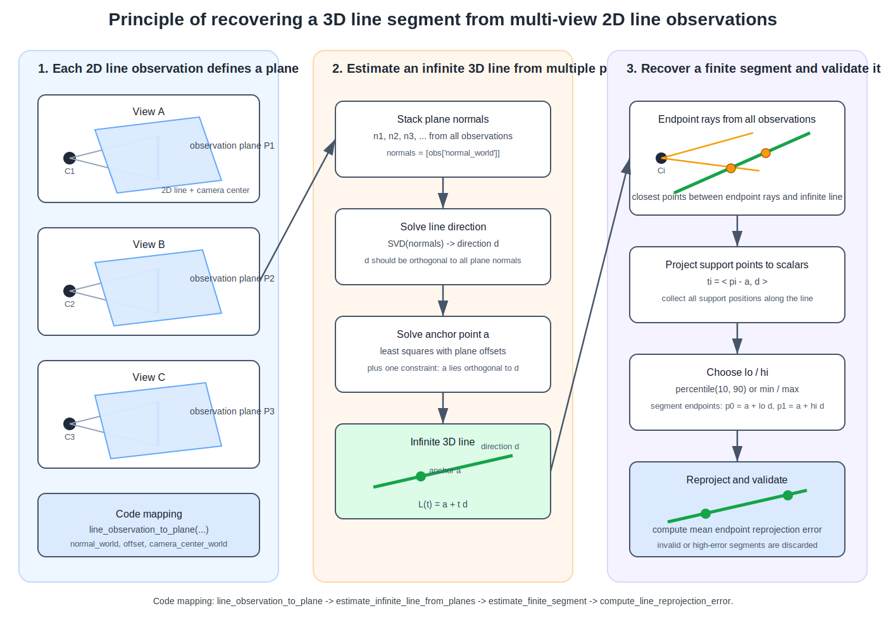
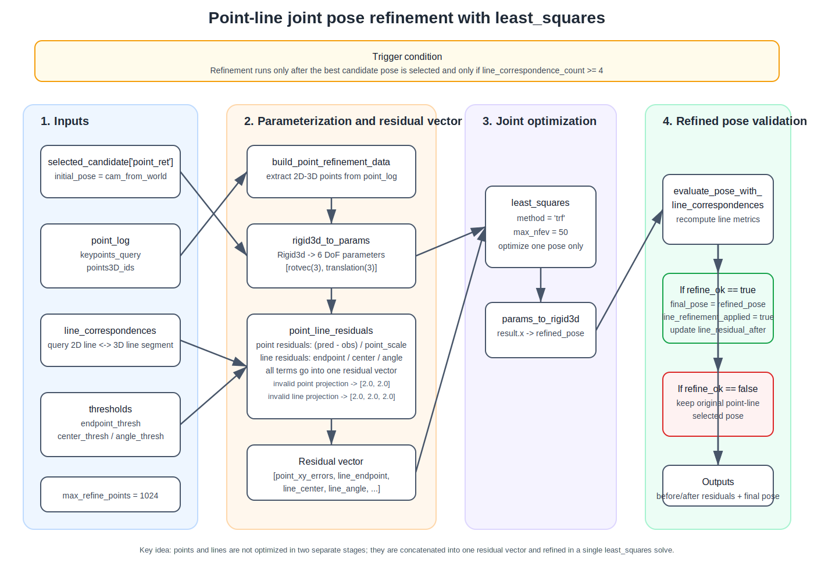

# `pipeline_joint_point_line_v2.py` 流程解读与对比

## 1. 说明范围

本文主要说明以下 4 条 Aachen 流程的关系，并重点解释 `hloc/pipelines/Aachen/pipeline_joint_point_line_v2.py` 相比其他流程做了哪些额外操作、相比上一版 `pipeline_joint_point_line.py` 有什么变化。

- `hloc/pipelines/Aachen/pipelinea.py`
- `hloc/pipelines/Aachen/pipeline.py`
- `hloc/pipelines/Aachen/pipeline_joint_point_line.py`
- `hloc/pipelines/Aachen/pipeline_joint_point_line_v2.py`

结论先说在前面：

- `pipelinea.py` 是最基础的 point-only Aachen 流程。
- `pipeline.py` 仍然是 point-only，但加了一个自定义的 `covisibility + spatial consistency recall`。
- `pipeline_joint_point_line.py` 是第一版 joint point-line 流程，线特征只参与 query-db 重排，不直接参与最终位姿求解。
- `pipeline_joint_point_line_v2.py` 是真正把线信息推进到“建图阶段 + 定位阶段”的版本：它先构建 `3D line map`，再在定位时建立 `2D line -> 3D line` 对应，并用线信息对候选位姿打分、筛选和细化。

---

## 2. Aachen 各流程的核心差异

| 流程 | 主要特征 | 检索/召回策略 | 线信息是否参与 | 最终定位方式 | 备注 |
| --- | --- | --- | --- | --- | --- |
| `pipelinea.py` | `xfeatplus_aachen` + `netvlad` | 直接 retrieval | 否 | `localize_sfm.main` 点位姿估计 | 最基础 |
| `pipeline.py` | `xfeatplus_aachen` + `gaussvladplusvgg` | 先 retrieval，再做共视+空间一致性召回扩展 | 否 | `localize_sfm.main` 点位姿估计 | 强调召回增强 |
| `pipeline_joint_point_line.py` | `joint_xfeat_mlsd_hloc` + `gaussvladplusvgg` | 直接 retrieval | 是，但只参与 query-db 重排 | `localize_sfm.main` 和 `localize_sfm_hybrid.main` | 线信息主要用于排序 |
| `pipeline_joint_point_line_v2.py` | `joint_xfeat_mlsd_hloc` + `gaussvladplusvgg` | 直接 retrieval | 是，参与建图、候选位姿评分、位姿细化 | `localize_sfm_point_line_v2.main` | 当前最完整的 point-line 版本 |

## 2.1 `pipeline_joint_point_line_v2.py` 的整体流程图

下图对应 V2 的完整主流程。和其他 Aachen 流程相比，新增的关键环节是：

- `db-db` 线匹配
- `3D line map` 构建
- `query 2D line -> 3D line` 对应建立
- point-line 联合位姿评分与细化

## 2.2 引入线约束后的原理图

下图说明 V2 为什么比上一版 `pipeline_joint_point_line.py` 更进一步。关键不是“只把线匹配数拿来重排”，而是把线约束真正提升为几何定位约束：

- 在参考库侧，先从多视角 2D 线恢复 `3D line segment`
- 在查询侧，把 query-db 的 verified line match 通过 assignment 映射到 `line3d_id`
- 在定位侧，把 `2D line -> 3D line` 对应用于候选位姿打分和联合优化

---

## 3. `pipeline_joint_point_line_v2.py` 的完整流程与代码对应

## 3.1 路径、配置与输出定义

这一阶段定义数据目录、SfM 目录、pair 文件、结果文件、3D 线地图文件和日志输出位置。

- 代码位置：
  - `hloc/pipelines/Aachen/pipeline_joint_point_line_v2.py:223-248`

这里新增了两个重要输出：

- `line_map.h5`
- `line_track_assignments.h5`

这两个文件是 V2 相比旧版最关键的新增中间结果。

## 3.2 抽取 joint point-line 特征

V2 默认使用 `joint_xfeat_mlsd_hloc`，这不是单纯的点特征，而是联合输出点和线。

- 配置位置：
  - `hloc/extract_features.py:89-103`
- 在 pipeline 中的调用位置：
  - `hloc/pipelines/Aachen/pipeline_joint_point_line_v2.py:250-251`
- 后续读取线数据的位置：
  - `hloc/utils/io.py:82-90`

这里得到的特征文件里不仅有 `keypoints`，还有：

- `line_segments`
- `line_descriptors`
- `line_scores`
- `line_centers`

这说明 V2 从特征层开始就为线建图和线定位做准备。

## 3.3 用 NVM 搭 SfM scaffold，并完成点三角化

这部分与旧版 joint point-line 流程基本一致，先用 Aachen 官方 NVM 和相机内参生成参考 SfM scaffold，然后生成 db-db 共视对，做点匹配和三角化。

- NVM scaffold：
  - `hloc/pipelines/Aachen/pipeline_joint_point_line_v2.py:253-259`
- db-db 共视 pair：
  - `hloc/pipelines/Aachen/pipeline_joint_point_line_v2.py:261-262`
- db-db 点匹配：
  - `hloc/pipelines/Aachen/pipeline_joint_point_line_v2.py:264-271`
- 点三角化：
  - `hloc/pipelines/Aachen/pipeline_joint_point_line_v2.py:273-274`

此时得到的是标准 3D 点地图 `reference_sfm`。

## 3.4 额外执行 db-db 线匹配，并构建 3D line map

这是 V2 最核心的新操作之一。旧版 `pipeline_joint_point_line.py` 没有这一步。

### 3.4.1 对数据库图像对做线匹配

- pipeline 调用位置：
  - `hloc/pipelines/Aachen/pipeline_joint_point_line_v2.py:276-284`
- 线匹配配置：
  - `hloc/match_line_features.py:18-35`
- 线匹配结果写入的字段：
  - `hloc/match_line_features.py:38-71`
- 线匹配执行主逻辑：
  - `hloc/match_line_features.py:112-160`

这里的线匹配不只写出 `line_matches0`，还写出了很多 V2 后面会用到的统计量，例如：

- `line_candidate_matches`
- `line_verified_matches`
- `line_verified_ratio`
- `line_mean_verified_similarity`
- `line_mean_verified_endpoint_error`
- `line_mean_verified_center_error`
- `line_mean_verified_angle_error_deg`

### 3.4.2 用 verified line matches 构建线轨迹

- pipeline 调用位置：
  - `hloc/pipelines/Aachen/pipeline_joint_point_line_v2.py:286-301`
- 线轨迹构建入口：
  - `hloc/line_mapping.py:413-441`
- 线轨迹聚合主逻辑：
  - `hloc/line_mapping.py:220-325`

具体做法是：

1. 遍历 db-db 图像对的 verified line matches。
2. 用 `UnionFind` 把跨图像对应的线段连成连通分量。
3. 每个连通分量视作一个潜在 3D 线轨迹候选。

对应原理图如下。它强调的是：在这一阶段，节点不是“图像”，而是 `(image_name, line_idx)`；边不是“任意匹配”，而是 `verified line match`；最终的 line track 就是 `UnionFind` 合并后的连通分量。

关键代码：

- `UnionFind`：
  - `hloc/line_mapping.py:24-50`
- verified line 边的聚合：
  - `hloc/line_mapping.py:233-249`

### 3.4.3 从多视角 2D 线观测恢复 3D 线段

这是 V2 真正把线从 2D 提升到 3D 的地方。

- 从单条 2D 线得到观测平面：
  - `hloc/line_mapping.py:102-118`
- 从多平面估计无限长 3D 直线：
  - `hloc/line_mapping.py:121-130`
- 从观测端点恢复有限线段：
  - `hloc/line_mapping.py:150-180`
- 计算重投影误差：
  - `hloc/line_mapping.py:190-199`

具体思路是：

1. 每个 2D 线段和相机中心可以定义一个 3D 平面。
2. 多个观测平面的交线给出 3D 直线方向和锚点。
3. 再利用端点光线与估计 3D 线的关系，恢复有限长度的 3D line segment。

对应原理图如下。它把这一步拆成 4 个连续的几何子过程：

- `line_observation_to_plane(...)`：单个视角的 2D 线观测转成 3D 观测平面
- `estimate_infinite_line_from_planes(...)`：多平面联合恢复无限长 3D 直线
- `estimate_finite_segment(...)`：利用多视角端点光线恢复有限线段范围
- `compute_line_reprojection_error(...)`：把恢复出的线段重新投影回各视角做误差检查

### 3.4.4 把 3D line map 和 line assignment 写入磁盘

- 写 `line_map.h5` 和 `line_track_assignments.h5`：
  - `hloc/line_mapping.py:328-364`
- 读取 line map：
  - `hloc/line_mapping.py:366-391`
- 汇总 line map 统计：
  - `hloc/line_mapping.py:394-410`

这一步的作用是：

- `line_map.h5` 保存每条 3D 线的几何信息和支持图像。
- `line_track_assignments.h5` 保存“某幅 db 图像中的第 i 条 2D 线，属于哪个 3D line id”。

后面定位时，正是通过这个 assignment 文件把 query-db 的 2D 线匹配提升为 query-3D 的线对应。

## 3.5 提取全局描述子，生成 query-db pair，并做点/线匹配

这部分和旧版流程相似，但 V2 会同时保留点匹配和线匹配两套 localization pair 的结果。

- 提取 retrieval descriptor：
  - `hloc/pipelines/Aachen/pipeline_joint_point_line_v2.py:303-304`
- 生成 query-db retrieval pairs：
  - `hloc/pipelines/Aachen/pipeline_joint_point_line_v2.py:306-313`
- query-db 点匹配：
  - `hloc/pipelines/Aachen/pipeline_joint_point_line_v2.py:315-322`
- query-db 线匹配：
  - `hloc/pipelines/Aachen/pipeline_joint_point_line_v2.py:324-332`

## 3.6 进入 V2 本地化：线不再只是“重排”，而是真正参与位姿选择

- pipeline 中调用 V2 localizer 的位置：
  - `hloc/pipelines/Aachen/pipeline_joint_point_line_v2.py:363-384`
- V2 localizer 主入口：
  - `hloc/localize_sfm_point_line_v2.py:402-602`

下面是 V2 localizer 内部最关键的几个阶段。

### 3.6.1 基于点匹配数量 + 线匹配质量进行 query-db 重排

- 代码位置：
  - `hloc/localize_sfm_point_line_v2.py:34-133`

V2 的 pair 打分不再只是“点匹配数 + verified line 数”，还引入了：

- verified line ratio
- verified line 的平均相似度
- 端点误差
- 中心误差
- 角度误差

最终得分：

- `0.45 * norm_points`
- `0.25 * norm_lines`
- `0.15 * verified_ratio`
- `0.15 * line_geometry_quality`

而旧版 V1 的 hybrid 只做：

- `point_weight * norm_points + line_weight * norm_lines`

对应代码：

- V2：
  - `hloc/localize_sfm_point_line_v2.py:95-133`
- V1：
  - `hloc/localize_sfm_hybrid.py:15-49`

### 3.6.2 不是直接对全部 db 图像做 PnP，而是构造候选子集

- 无共视聚类时的候选子集：
  - `hloc/localize_sfm_point_line_v2.py:136-150`
- 开启共视聚类时的 cluster 候选：
  - `hloc/localize_sfm_point_line_v2.py:362-372`
- 主循环中使用位置：
  - `hloc/localize_sfm_point_line_v2.py:478-485`

这说明 V2 不再只跑“一次 PnP”，而是会对多个候选子集分别求位姿，再让线信息参与候选位姿选择。

这里“构造候选子集”的意思是：

- 原来的 point-only / hybrid 默认做法，通常是把某个 query 检索到的全部 `db_ids` 一次性送入 `pose_from_cluster(...)`，直接求一个位姿。
- V2 不这么做。它会先把重排后的 `db_ids` 切成几个候选集合，例如 `top10`、`top20`、`topK`、`all`，然后对每个子集分别执行一次 point PnP。
- 这样一来，一个 query 不再只产生 1 个初始位姿，而是会产生多个候选位姿，后续再利用线对应和线误差去判断哪一个更可信。

换句话说，可以把两者的差异概括成：

- 原始默认流程：`1 个检索结果集 -> 1 次 PnP -> 1 个位姿`
- V2 流程：`1 个检索结果集 -> 多个候选子集 -> 多次 PnP -> 多个候选位姿 -> 用线约束筛选最优位姿`

它和原来的方法并不完全相同。

- 如果原来的流程没有开启 `covisibility_clustering`，那么原始 `localize_sfm` / `localize_sfm_hybrid` 基本就是把全部 `db_ids` 一次性做 PnP；这一点与 V2 明显不同。
- 如果原来的流程开启了 `covisibility_clustering`，那么原始方法也会形成多个 cluster，并对每个 cluster 做一次 PnP；这一点和 V2 的“多候选位姿”思路相似。
- 但即使在这种情况下，V2 仍然更进一步，因为它不是只按点内点数选最优，而是会把线对应数、线内点数、线重投影质量、线角度质量一起纳入候选位姿评分，并在最后做 point-line 联合 refinement。

因此，这一小节的本质变化不是“把 PnP 写法稍微改了一下”，而是把定位过程从“单次点位姿估计”扩展成了“多候选点位姿假设 + 线约束验证与筛选”。

### 3.6.3 每个候选子集先做 point-based PnP

- V2 中调用：
  - `hloc/localize_sfm_point_line_v2.py:483-485`
- 实际 PnP 构造与求解：
  - `hloc/localize_sfm.py:83-137`

也就是说，V2 的初始位姿仍然来自点匹配和 2D-3D 点对应；它不是完全抛弃点，而是在点位姿之后再引入线验证与线细化。

### 3.6.4 把 query 的 2D 线与 3D line map 建立对应

- 代码位置：
  - `hloc/localize_sfm_point_line_v2.py:153-204`

这一步是 V2 相比 V1 的本质变化。

做法是：

1. 读取 query 图像的线段。
2. 遍历 query-db 的 verified line matches。
3. 用 `line_track_assignments.h5` 查出 db 线段属于哪个 `line3d_id`。
4. 用 `line_map.h5` 拿到这条 3D 线的空间端点 `segment_endpoints_xyz`。
5. 对每条 query 线只保留一个最优 3D 线候选。

因此，V2 终于拿到了真正的 `2D line -> 3D line` 对应，而不是只拿线匹配数做排序。

### 3.6.5 用线对应评估每个候选位姿

- 代码位置：
  - `hloc/localize_sfm_point_line_v2.py:207-261`
- 在主循环中的调用：
  - `hloc/localize_sfm_point_line_v2.py:489-504`

V2 会把候选位姿下的 3D 线投影回 query 图像，然后统计：

- `line_correspondence_count`
- `line_inlier_count`
- `line_reproj_quality`
- `line_angle_quality`
- `mean_endpoint_error`
- `mean_center_error`
- `mean_angle_error`
- `mean_line_combined_error`

这些指标被后续的候选排序和位姿细化继续使用。

### 3.6.6 融合点与线指标，对多个候选位姿打分

- 代码位置：
  - `hloc/localize_sfm_point_line_v2.py:384-399`
- 在主循环中的使用：
  - `hloc/localize_sfm_point_line_v2.py:520-525`

V2 的候选位姿得分为：

- `0.50 * norm_point_inliers`
- `0.20 * norm_line_inliers`
- `0.15 * line_reproj_quality`
- `0.15 * line_angle_quality`

这比 V1 更进一步：V1 只对 db 图像顺序重排，V2 则是对“候选位姿”本身打分。

### 3.6.7 使用点残差 + 线残差做非线性位姿细化

- 残差构造：
  - `hloc/localize_sfm_point_line_v2.py:289-323`
- 细化求解：
  - `hloc/localize_sfm_point_line_v2.py:326-359`
- 主循环中的触发条件和调用：
  - `hloc/localize_sfm_point_line_v2.py:527-552`

对应原理图如下。它强调的是：这一阶段不是“先优化点、再优化线”，而是把点残差和线残差拼接进同一个 residual vector，由一次 `least_squares(...)` 联合优化 6 自由度位姿参数。

这里调用 `scipy.optimize.least_squares`，同时最小化：

- 2D-3D 点的重投影误差
- 线端点误差
- 线中心误差
- 线角度误差

这一步真正的执行逻辑可以拆成下面几层：

1. 先确定 refinement 何时触发。
   只有在当前 query 的最佳候选位姿已经通过 point-line 评分被选出来之后，代码才会检查是否满足 `line_correspondence_count >= 4`；只有满足这个条件时，才会调用 `refine_pose_with_points_and_lines(...)`。因此 refinement 不是每个 query 都会做，也不是一开始就做。

2. 初值不是随机的，而是 point-based PnP 的结果。
   优化初值 `initial_pose` 来自 `selected_candidate['point_ret']['cam_from_world']`，也就是前一阶段基于点对应求得、并已通过点线联合评分选中的候选位姿。V2 不是从空白位姿开始搜，而是在一个已经较合理的姿态附近继续细化。

3. 优化变量是 6 自由度位姿参数。
   `rigid3d_to_params(...)` 会把 `pycolmap.Rigid3d` 转成 6 维向量：前 3 维是旋转向量 `rotvec`，后 3 维是平移 `translation`；优化完成后，再通过 `params_to_rigid3d(...)` 把 `result.x` 还原成 `refined_pose`。

4. 点残差来自 `build_point_refinement_data(...)`。
   这一步从 `point_log` 中取出 `keypoints_query` 和 `points3D_ids`，恢复出用于 refinement 的 2D-3D 点对应；如果点太多，则用 `max_refine_points` 做下采样。对每个点，残差是投影点与观测点之差，并再除以 `point_scale` 做尺度归一化。

5. 线残差来自 3D 线段投影后的几何误差。
   对每条 `line_correspondence`，代码会把其 `segment_endpoints_xyz` 投影到 query 图像，然后计算 3 类误差：
   - `endpoint_error / endpoint_thresh`
   - `center_error / center_thresh`
   - `angle_error / angle_thresh`
   这 3 个量与点残差一起被追加到同一个残差向量中，因此优化器是在同时兼顾点和线，而不是分两轮做优化。

6. 对不可见或投影失败的情况，会使用固定惩罚项。
   如果某个 3D 点投影无效，残差里会加入 `[2.0, 2.0]`；如果某条 3D 线段投影失败，残差里会加入 `[2.0, 2.0, 2.0]`。这样做的作用是：让优化器对几何上明显不合理的姿态保持惩罚，而不是把这些无效项静默忽略掉。

7. `least_squares` 成功后才会真正替换最终位姿。
   代码使用 `least_squares(point_line_residuals, x0, method='trf', max_nfev=50, ...)` 求解。如果 `result.success` 为真，则把结果转成 `refined_pose`，重新调用 `evaluate_pose_with_line_correspondences(...)` 计算 refined 后的线指标，并更新：
   - `final_pose`
   - `line_refinement_applied`
   - `line_residual_after_refine`
   如果优化失败，则保留原来通过 point-line 评分选出的位姿，不会强行替换。

8. 这一步也是 V2 与 V1 的一个本质差异。
   V1 中，线主要用于 query-db 排序；V2 在这里把线真正放进了连续优化目标函数里，让线约束直接参与最终位姿细化。

这一步在旧版 V1 中完全不存在。

### 3.6.8 记录更丰富的定位日志

- 代码位置：
  - `hloc/localize_sfm_point_line_v2.py:559-585`

V2 会额外记录：

- 重排后的 db 顺序
- 每个候选子集的点/线统计
- 最终选中的候选索引和分数
- 线对应数、线内点数
- 细化前后线残差
- 是否执行了线细化
- 位姿是如何被选中的

这也是后面 `comparison_v2.json` 能做更细粒度分析的基础。

## 3.7 输出 point / hybrid / v2 的对比统计

- 统计函数：
  - `hloc/pipelines/Aachen/pipeline_joint_point_line_v2.py:69-220`
- 生成总对比 JSON：
  - `hloc/pipelines/Aachen/pipeline_joint_point_line_v2.py:386-437`

V2 相比 V1 多了以下分析项：

- `line_map_summary`
- `point_line_v2_summary`
- `delta_point_line_v2_minus_point`
- `delta_point_line_v2_minus_hybrid_v1`
- `v2_line_effect_analysis`

这说明 V2 不仅修改了定位流程，还把“线到底帮了多少”变成了可以直接分析的输出。

---

## 4. 相比其他流程，`pipeline_joint_point_line_v2.py` 具体多做了哪些操作

按“比其他流程多出的动作”来总结，V2 主要多做了 5 类事：

### 4.1 多做了数据库图像之间的线匹配

其他流程：

- `pipelinea.py` 和 `pipeline.py` 没有线匹配。
- `pipeline_joint_point_line.py` 只对 `query-db` 做线匹配。

V2 新增：

- `db-db` 线匹配，用于建 3D line map。

代码：

- `hloc/pipelines/Aachen/pipeline_joint_point_line_v2.py:276-284`

### 4.2 多做了 3D 线地图构建

其他流程：

- 没有 3D 线地图。

V2 新增：

- 聚合多视角线轨迹。
- 恢复 3D 无限直线和有限线段。
- 写入 `line_map.h5` 和 `line_track_assignments.h5`。

代码：

- `hloc/pipelines/Aachen/pipeline_joint_point_line_v2.py:286-301`
- `hloc/line_mapping.py:220-410`

### 4.3 多做了 query 2D 线到 3D 线的关联

其他流程：

- V1 只知道“query 和某个 db 图像之间有多少 verified line matches”。

V2 新增：

- 把 db 图像上的线，通过 `line_track_assignments.h5` 映射回 `line3d_id`。
- 从而建立 `query line -> 3D line segment` 对应。

代码：

- `hloc/localize_sfm_point_line_v2.py:153-204`

### 4.4 多做了候选位姿的线验证、排序和二次选择

其他流程：

- `pipelinea.py` / `pipeline.py` 只有一次 point-only 定位。
- V1 只有“query-db 对”的重排，没有“位姿候选”的二次比较。

V2 新增：

- 对多个候选子集分别做 point PnP。
- 使用线对应评估每个候选位姿。
- 用点内点数和线质量综合排序候选位姿。

代码：

- `hloc/localize_sfm_point_line_v2.py:136-150`
- `hloc/localize_sfm_point_line_v2.py:362-399`
- `hloc/localize_sfm_point_line_v2.py:483-525`

### 4.5 多做了 point + line 联合非线性细化

其他流程：

- 没有这一步。

V2 新增：

- 联合最小化点重投影误差和线几何误差。

代码：

- `hloc/localize_sfm_point_line_v2.py:289-359`
- `hloc/localize_sfm_point_line_v2.py:527-552`

---

## 5. 相比上一版 `pipeline_joint_point_line.py`，V2 的主要不同点

## 5.1 线信息的使用阶段前移了

V1：

- 线只出现在 localization 阶段，并且只是 query-db 匹配统计。

V2：

- 线已经进入 mapping 阶段，先构建 3D line map，再把这张图用于定位。

对应代码：

- V1 只有 localization line match：
  - `hloc/pipelines/Aachen/pipeline_joint_point_line.py:197-204`
- V2 额外加入 db-db line match 和 line map：
  - `hloc/pipelines/Aachen/pipeline_joint_point_line_v2.py:276-301`

## 5.2 重排依据从“计数”升级成了“计数 + 几何质量”

V1：

- 只看点匹配数量和 verified line 数量。

V2：

- 额外考虑 verified ratio、平均相似度、端点误差、中心误差、角度误差。

对应代码：

- V1：
  - `hloc/localize_sfm_hybrid.py:15-49`
- V2：
  - `hloc/localize_sfm_point_line_v2.py:34-133`

## 5.3 位姿求解从“单次 point PnP”升级成了“多候选 point PnP + line 评估”

V1：

- 重排后直接调用 `pose_from_cluster(...)`，最终位姿仍然完全由点决定。

V2：

- 为多个子集分别求初始位姿。
- 用 2D-3D 线对应对这些位姿做验证和排序。

对应代码：

- V1：
  - `hloc/localize_sfm_hybrid.py:96-132`
- V2：
  - `hloc/localize_sfm_point_line_v2.py:478-525`

## 5.4 V2 新增了 point-line 联合细化

V1：

- 没有 refinement。

V2：

- 当线对应数足够时，使用 `least_squares` 对姿态进一步优化。

对应代码：

- `hloc/localize_sfm_point_line_v2.py:326-359`
- `hloc/localize_sfm_point_line_v2.py:527-552`

## 5.5 输出分析更丰富

V1 输出：

- point-only summary
- hybrid summary
- delta_hybrid_minus_point

V2 输出：

- line map summary
- V2 line correspondence / line inlier / line refinement gain
- V2 对 point / hybrid 的增益与伤害分析

对应代码：

- V1：
  - `hloc/pipelines/Aachen/pipeline_joint_point_line.py:235-273`
- V2：
  - `hloc/pipelines/Aachen/pipeline_joint_point_line_v2.py:386-437`

---

## 6. 与 `pipeline.py` 和 `pipelinea.py` 的额外差异

## 6.1 相比 `pipelinea.py`

`pipelinea.py` 基本上是：

1. 提点特征。
2. 建点云 SfM。
3. retrieval。
4. point matching。
5. `localize_sfm.main`。

代码：

- `hloc/pipelines/Aachen/pipelinea.py:17-79`

它没有：

- 线特征
- 线匹配
- 3D 线地图
- 线重排
- 线细化

## 6.2 相比 `pipeline.py`

`pipeline.py` 的创新点不在线，而在召回：

- 先做共视召回。
- 再用本质矩阵 RANSAC 的 inlier ratio 做空间一致性召回。
- 最后把新的 pair 再送进 point-only localization。

代码：

- 共视召回：
  - `hloc/pipelines/Aachen/pipeline.py:56-80`
- 空间一致性召回：
  - `hloc/pipelines/Aachen/pipeline.py:23-54`
- 整体 recall 增强流程：
  - `hloc/pipelines/Aachen/pipeline.py:82-147`
- 在主流程中的调用：
  - `hloc/pipelines/Aachen/pipeline.py:199-223`

因此，`pipeline.py` 和 V2 的思路差异很大：

- `pipeline.py` 是“先把可能有用的 db 图像召回得更全，再做 point-only 定位”。
- `pipeline_joint_point_line_v2.py` 是“先保持 retrieval 不变，再让线信息在定位内部参与筛选、验证和优化”。

---

## 7. 当前代码中的两个复现注意点

## 7.1 `pipeline_joint_point_line_v2.py` 里 point/hybrid 执行被注释了，但后面仍然读取它们的日志

- 被注释的位置：
  - `hloc/pipelines/Aachen/pipeline_joint_point_line_v2.py:336-361`
- 后面仍然读取日志的位置：
  - `hloc/pipelines/Aachen/pipeline_joint_point_line_v2.py:386-393`

这意味着：

- 如果输出目录中还没有先前生成的 `point` 和 `hybrid` 日志文件，当前脚本在做 comparison summary 时会失败。

换句话说，当前 V2 脚本更像是“V2 主流程 + 依赖已有 point/hybrid 日志做对比分析”，而不是完全自洽的一次性三路对比脚本。

## 7.2 `pipeline.py` 当前调用 `localize_sfm.main(...)` 时传入了 `recall_data`

- 调用位置：
  - `hloc/pipelines/Aachen/pipeline.py:214-223`
- 但当前 `localize_sfm.main` 的签名里没有 `recall_data`：
  - `hloc/localize_sfm.py:140-151`

这说明 `pipeline.py` 这条自定义 recall 流程在当前分支中可能还没有完全和 `localize_sfm.py` 对齐。

---

## 8. 总体算法流程总结

为了便于从整体上理解 `pipeline_joint_point_line_v2.py`，可以把它概括成下面 8 个连续步骤。

1. 步骤一：抽取 joint point-line 特征。
   这一阶段对数据库图像和查询图像统一提取点特征与线特征，得到关键点、描述子、线段和线描述子。它的作用是为后续的点建图、线建图、点匹配和线匹配提供统一输入。

2. 步骤二：构建参考 3D 点地图。
   先利用 Aachen 官方 NVM 搭建参考 SfM scaffold，再生成 db-db 共视图像对、完成点匹配和三角化，得到标准的 `reference_sfm`。它的作用是提供后续 point-based localization 所需的 3D 点地图。

3. 步骤三：构建参考 3D 线地图。
   在数据库图像之间执行线匹配，只保留 verified line matches，并把跨图像一致的 2D 线段聚成线轨迹；随后利用多视角 2D 线观测恢复 3D line segment，写入 `line_map.h5` 和 `line_track_assignments.h5`。它的作用是把原本只存在于图像中的线结构提升成可用于定位的 3D 几何实体。

4. 步骤四：为 query 生成候选数据库图像。
   先提取全局描述子，再对 query 做图像检索，生成 query-db pairs；然后分别计算 query-db 的点匹配和线匹配。它的作用是从大规模数据库中先找出可能与当前 query 对应的候选参考图像。

5. 步骤五：基于点和线信息对候选 db 图像重排，并构造候选子集。
   V2 会结合点匹配数、verified line 数、verified ratio 以及线几何质量，对检索到的 db 图像重新排序；随后构造若干候选子集，或者在开启 `covisibility_clustering` 时构造若干共视 cluster。它的作用是减少噪声参考图像对位姿估计的干扰，并为后续生成多个候选位姿假设。

6. 步骤六：先用 2D 点 - 3D 点对应求初始位姿。
   对每个候选子集，先调用 point-based PnP 得到一个初始 `cam_from_world`。它的作用是先利用传统点约束给出一个可行的相机姿态估计，作为后续引入线约束的基础。

7. 步骤七：建立 query 2D 线到 3D 线的对应，并对候选位姿做点线联合筛选。
   V2 通过 query-db 的 verified line matches 和 `line_track_assignments.h5`，把 db 图像中的 2D 线映射到 `line3d_id`，从而得到 `query 2D line -> 3D line` 对应；随后把 3D 线投影回 query 图像，计算端点误差、中心误差和角度误差，与点内点数一起对候选位姿打分。它的作用是利用线约束判断“哪个候选位姿在几何上更合理”。

8. 步骤八：当线对应足够时，做 point-line 联合 refinement，并输出最终结果。
   当最佳候选位姿的 `line_correspondence_count >= 4` 时，V2 会把点重投影残差和线端点/中心/角度残差一起送入 `least_squares`，联合优化 6 自由度位姿参数；优化成功后用 refined pose 更新最终结果，并记录细化前后线残差。它的作用是进一步减小几何误差，让最终位姿同时兼顾点约束和线约束。

## 8.1 一句话总结

`pipeline_joint_point_line_v2.py` 相比其他 Aachen 流程，最大的不同不是“多匹配了几条线”，而是把线真正变成了一个和 3D 地图、候选位姿、非线性优化都相连的几何约束：

- 在线建图阶段，它构建 `3D line map`。
- 在线定位阶段，它建立 `2D line -> 3D line` 对应。
- 在位姿选择阶段，它用线约束给候选位姿打分。
- 在位姿优化阶段，它把线残差和点残差一起做联合细化。

因此，V2 相比 V1 的本质升级可以概括为：

- 从“线用于重排”升级为“线用于几何定位”。
